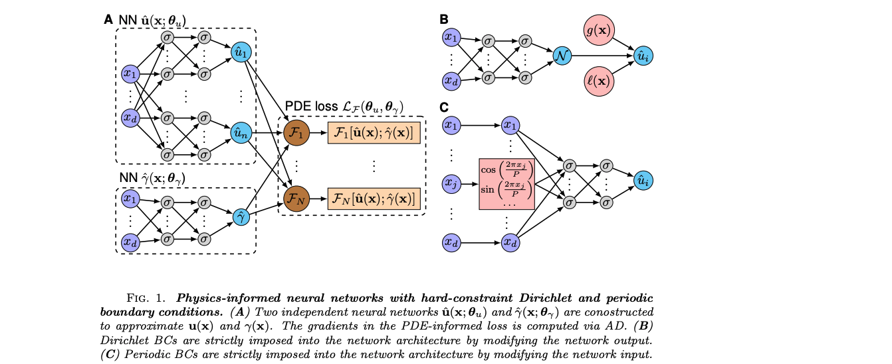

# Aug-NeRF: Training Stronger Neural Radiance Fields with Triple-Level Physically-Grounded Augmentations
2022

regularize nerf 模型和训练过程，减少outlier
- 考虑相机位置预测中的noise，考虑输入图片中的noise
- regularize使得学习的物体表面平滑
- 没有使用物理公式

# Physics-Driven Diffusion Models for Impact Sound Synthesis from Videos 
2023

场景音频生成，输入包含物理参数

相关工作
- 音频生成
  - 手工方法：50：使用linear model生成rigid body音频
  - 5：conditional gan生成音频
  - 62：sampleRNN based method
  - vision转乐器声音：1- 47 48

模型
- 1.使用signal processing得到物理parameter，使用nn预测residual parameter
  - 使用音频样本，将音频样本分为D个damped oscillation，得到每一oscillation参数
- 2.使用vision + 1.中输出，通过DDPM生成音频spectrogram

# DeepONet
## DeepONet：Learning nonlinear operators via deeponet based on the universal approximation theorem of operators
2020

提出deeponet的论文，学习的operator针对dynamic system (ode)和pde

相关工作
- operator针对dynamic system中的ode
  - 22 33：使用nn学习可用difference equation描述的dynamic system
  - 模拟一特定dynamic system的evolution
    - 20：使用rnn + reservior computing
    - 23：residual net
    - 9：autoencoder
    - 24：FNN
    - 6：neural ordinary differential equation
    - 12：neural jump stochastic differential equation

## Learning the solution operator of parametric partial differential equations with physics-informed DeepOnets

physics-informed DeepOnets论文

## Long-time integration of parametric evolution equations with physics-informed deeponets 
2021

physics informed deepONet的variant，进行long term dynamic system
- 在loss中添加由pde定义的residual项，deepOnet在$<\Delta t$时间步的样本上训练，在$>\Delta t$时间上eval
- eval时 branch模型得到$\{u(t) | t \in [0, \Delta t)\}$，trunk模型得到$(x, t = \Delta t)$，模型输出作为$\Delta x$时刻$u(x)$和x加入$\{u(t) | t \in [0, \Delta t)\}$作为branch模型下一次预测输入
- 即autoregressive预测

# Unsupervised physics-informed disentanglement of multimodal data for high-throughput scientific discovery
2022

提出vae结构，发现signal中fingerprint。
- 针对mnist数据集，分析embedding分布的论文

# Residual-based attention in physics-informed neural networks
2024 https://github.com/soanagno/rba-pinns

不使用grad的pinn模型

# NOMAD: Nonlinear Manifold Decoders for Operator Learning
2022

使用non linear deeponet decoder
- 即不同于deeponet使用branch trunk模型的输出点乘计算结果，而是将branch输出和每一yconcat通过mlp计算结果

相关工作
- 23：fourier neural operator，使用fourier transform theorem计算integral
- 2：deeponet + pca based representation
- 36：random feature approach + deeponet
- 15：使用wavelet approximation to integral transform
- 23：attention based + deeponet

# DeepM&Mnet: Inferring the electroconvection multiphysics fields based on operator approximation by neural networks
2020

仅使用样本 不用pde做loss 训练多个deeponet。随后训练mlp模型预测deeponet输入，训练mlp时deeponet固定不参与训练
- 共有$\phi, c^+, c^-, u, v$ 5变量，都为关于$(x, y)$的函数
- 第一deeponet：branch模型得到$c^+, c^-$，trunk模型得到xy，预测$\phi(x, y)$
- 其余4 deeponet都得到$\phi(x, y)$的值做branch模型输入，分别预测$c^+(x, y), c^-(x, y), u(x, y), v(x, y)$
- 第二阶段训练的mlp得到$(x, y)$，预测$\phi(x, y), c^+(x, y), c^-(x, y), u(x, y), v(x, y)$值

# Optimal control of PDEs using physics-informed neural networks
2022

得到governing pde，求control variable最小化loss
- control variable为pde或boundary condition中一参数
- control variable作为可学习参数参与反向传播，和pinn同时从头开始训练

定义
- control variable 为$c_v(x, t), c_b(x, t), c_0(x)$
- pde函数depend on control variable：
  - 令x domain 为$\Omega \in R^d$
  - $F(u(x, t), c_v(x, t)) = 0, x \in \Omega, t \in [0, T]$
  - boundary condition $B(u(x, t), c_b(x, t)) = 0, x \in \delta\Omega, t \in [0, T]$
  - initial condition $I(u(x, t), c_0(x)) = 0, x \in \Omega$
- 用user define loss $J(u, c)$，gradient descent得到一满足pde的state value u和condition variable c

模型
- $u(x, t)$和三个$c(x, t)$都使用nn近似，即u为一pinn
- 代价函数为u的PINN loss + J(u, c)，即u和c同时参与优化。J(u, c)项有loss weight，即pinn和control variable的nn有不同learning rate

# PhyDNet: Disentangling Physical Dynamics from Unknown Factors for Unsupervised Video Prediction
2020

提出PhyCell，进行video prediction。phycell抽卷积特征对图像xy轴坐标的求导，作为后续模型的输入
- 将pde dynamics和未知complementary info分离，提出PhyCell 对latent space进行pde constrained prediction

相关工作
- 进行video prediction，不使用物理信息
  - adversarial training
    - 40 62 29
  - stochastic model
    - 7 41
  - 用geometric信息进行constraint prediction
    - 16 24 75
  - disentangling factor for variation
    - 60 58 12 21
- data driven pde discovery
  - "对可能的differential term使用sparse regression"
    - [2016] **Discovering governing equations from data by sparse identification of nonlinear dynamical systems**
    - [2017 science advances] Datadriven discovery of partial differential equations
    - [2017 Royal society] **Learning partial differential equations via data discovery and sparse optimization**
  - **使用nn近似pde解**
    - [2018 journal of ML research] Deep hidden physics models: Deep learning of nonlinear partial differential equations
      - Physics informed deep learning (part ii): Data-driven discovery of nonlinear partial differential equations
    - [2019] Differentiable physics-informed graph networks
  - 使用numerical pde解+nn预测dynamic system state
    - [2015 EUSIPCO] Bilinear residual neural network for the identification and forecasting of geophysical dynamics
    - [2019 Journal of Physics]  **Data driven governing equations approximation using deep neural networks**
  - [2018 ICML] **PDE-Net: Learning PDEs from data**：用cnn近似partial derivative

模型
- 整体模型：
  - 
  - rnn结构，一时间步中的预测包含并行的phycell和conv lstm
- phycell
  - 
  - phycell得到latent特征h，训练conv层输出$\frac{d^{i+j} h}{d x^i dy^j}$，做后续层输入 使得模型可对微分值进行计算
    - 训练方式：将conv操作泰勒展开，loss项使得泰勒展开中微分项的系数为1

# Causal Discovery in Physical Systems from Videos
2020

1.从多帧图像抽temporal consistent keypoint 2.inference model预测key point组成的graph distribution 3.decoder预测后续帧
- cnn抽key point，gnn做inference model，每一node输出multivariate gaussian mean variance预测后续key point位移

模型
- 一样本m有$\{I_m^t\}$共T张图像
- $f_{\theta}^V$得到每一帧图像$I_m$，输出每一图分别的key point $V_m^t = f_{\theta}^V(I_m^t)$
- $f^{\epsilon}_{\phi}$得到样本所有key point，预测两两node间confounding factor特征$\epsilon_m = f^{\epsilon}_{\phi}(V_m^{1..T})$
  - $\epsilon_m = \{(g_{m, ij}^c, g_{m, ij}^d) | \forall i, j \in node\}$
  - 使用graph nn：Interaction Network IN实现
- 后续帧key point state为$V_m^{T+1} = f_{phi}^D(V_m^{1..T}, \epsilon_m)$

# Interaction Networks for Learning about Objects, Relations and Physics
2016

输入为graph，gnn预测每一node后续帧state。针对物理场景，即node state为物理性质

模型
- 定义
  - graph中每一node有$o_i$为特征，两两node间关系为$(i, j, r_{ij})$，有外界对每一node作用$x_i$
- relation model $f_R(o_i, o_j, r_{ij})$预测node $i$ 对$j$的影响$e_{ij}$
- aggregation function 将一node j (得到的所有$e_{\dot j}$ + 外界作用$x_i$) 合并为$p_j$
- object model得到每一node合并后的特征，预测下一时刻node的状态 $o_j'$

# Interpretable Intuitive Physics Model
2018

bottleneck特征中有物理参数

相关工作
- 12：Inverse Graphic Network：训练使得graphic code layer的输出每一维度代表不同物理性质
- future visual prediction
  - 22：预测光流图
  - 30：使用bilinear sampling，将optic flow的warping变为可导，使得模型能够end to end训练

模型
- cnn encoder得到多帧图像，输出有物理参数的特征向量
  - 输出特征向量$z$分为4部分，4部分分别对应(质量$z_m$, 摩擦力$z_f$, 速度$z_v$, 物体颜色信息$z_c$)
  - 对一batch样本，样本间仅更改一物理特性。如 一batch的样本为同样速度同样摩擦力的物体撞击，但每一样本的物体质量不同
  - 有loss：对一batch内不同样本ij，令ij间更改的物理属性为a，则loss为$\sum_{b \neq a} \|z_b\|$。
    - 即限定特征4部分中 仅$z_a$可不同，其余三项$z_b$应相同
- cnn decoder预测光流图
- 代价函数即reconstruct下一帧图像的loss + encoder输出向量

# CoPhy: Counterfactual learning of Physical Dynamics 
2020

得到一物体移动视频，并指定修改一initial condition，预测修改initial condition后的视频

模型
- 
- A：给定物体移动视频的初始帧/initial condition，B：给定视频的后续帧
- C：initial condition，D：模型预测的C的后续帧
- 处理AB：
  - GCN对每一时间步的场景分别encode：得到场景物体graph，优化每一node特征
  - RNN对每一物体在不同场景的特征分别作为一序列进行encode：得到GCN对一物体不同时间步的特征，预测此物体的counfounding factor(即物理属性)
    - 所有物体共用一rnn预测state，使得模型可对任意物体数量的场景进行inference
    - 仅使用rnn的hidden state输出，忽略rnn对下一时间步的输出
    - 最后一时刻的hidden state输出作为counfound factor输出
- 处理CD：
  - rnn输出的counfound factor和C中每一node特征concat，通过GCN + rnn + linear decode层预测下一时刻state
    - 仍忽略rnn的输出，仅使用hidden state通过linear层预测state
  - D中每一时刻每一node特征都和counfounding factor concat，通过GCN + rnn + linear decode预测state

# Pde-net: Learning pdes from data
2018

同PhyCell，将卷积计算泰勒展开，限制kernel值使得输出值为此卷积层输入关于第一层输入的求导，随后通过一kernel不受限的卷积。

将以上两层卷积作为一block，模型包含多个block相连。每一block共享参数

# hPINN：Physics-informed neural networks with hard constraints for inverse design
2021

提出将pde作为hard constrain加入inverse design，而不是作为loss 等soft constrain。
- 由于如果将pde作为soft constrain，模型将在objective和pde constrain间作取舍，导致输出design不符合pde要求

模型
- 
- **BC中method针对等式形式的boundary condition，penalty method和augmented Lagrangian method针对pde和$\leq, \geq$的boundary condition**
- A：inverse design使用的PINN，$\gamma(x)$为inverse design求解的变量，如一物体结构
  - design $\Gamma(x)$为可学习参数，参与优化。
- hard constrain：更改模型结构，使得输出必定满足$u(x) = c$的boundary condition
  - B：Dirichlet Boundary condition：即定义边界位置值为固定值
    - 令$u$函数为pde求解，$u(x) = g(x), \forall x \in \Gamma_D$
      - $\Gamma_D$为$u$整个boundary $\delta \Omega$中的一子集，即针对boundary $\delta \Omega$采样部分点取boundary值
    - 模型结构：$u(x) = g(x) + l(x)N(x)$
      - N(x)为模型输出。当$x \in \Gamma_D$时 $l(x) = 0$，否则 即当$x\in \Omega - \Gamma_D$时 $l(x) > 0$
      - $l(x)$函数为手动设计
  - C：peoridic boundary condition
    - 当u关于$x$中$x_i$项periodic时，输入x向量为$[x_0, ..., sinusodal(x_i), ...]$
    - 即 将$x_i$元素替换为$[cos(\frac{2\pi x_i}{P}), sin(\frac{2\pi x_i}{P}), cos(\frac{4\pi x_i}{P}), sin(\frac{4\pi x_i}{P}), ...]$
- penalty method
  - 将constrained optimization改为unconstrained optimization
  - 令design的目标函数为$L_{objective}$，hard constrain (即pde) 为$F(u(x), \gamma(x)) = 0$，不等式constrain 为$h(x_i) \leq c_i$
  - 则unconstrained optimization为最小化 $L = L_{objective} + \mu_f \sum_i \|F(u(x_i), \gamma(x))\|^2 + \mu_h \sum_j \max(h(x_j) - c_j, 0)^2$
    - 对$h(x_j) - c_j$取$max(..., 0)$后再做平方，使得loss不对满足$h(x_i) \leq c_i$的项计算loss
  - 每步更新$\mu_f^k = \beta_f \mu_f^{k-1}$，$\mu_u^k = \beta_u \mu_u^{k-1}$
    - $\mu_f, \mu_u$随迭代次数增大而增大，当$\mu$足够大时 模型符合constrain
    - $\mu_f^{k-1}, \mu_u^{k-1}$代表上一步$\mu_f, \mu_u$
- Augmented Lagrangian method：另一encode hard constrain方法
  - 使用Augmented Lagrangian method加快模型converge 并使得训练时无需将constrain的系数增加到极大值保证模型符合constrain
  - constrained problem同penalty method中
  - unconstrained optimization loss $L = L_{objective} + \mu_f \sum_i \|F(u(x_i), \gamma(x))\|^2 + \mu_h \sum_j \max(h(x_j) - c_j, 0)^2 + \lambda_f \sum_i F(u(x_i), \gamma(x)) + \lambda_h \sum_j (h(x_j) - c_j)$
  - $\mu$更新同penalty method
  - $\lambda_f^k = \lambda_f^{k-1} + 2 \mu_f^{k-1} F(u(x_i), \gamma(x))$
    - $\lambda_h^k$更新同理

？例子中采样在整个场景中都进行采样，如果采样点集中在一部分区域 模型效果是否显著下降

# ThreeDWorld: A Platform for Interactive Multi-Modal Physical Simulation

# Ben Moseley PhD thesis

能否使用deeponet branch输出做hypernet参数 y值通过hypernet进行预测
- 由于branch模型即预测一func参数，使得输出func为complex func可能可以预测更复杂问题

能否使用branch net预测一func沿时间的转变，如nerf随时间变化即通过多次branch模型
- branch模型本身为对一func进行操作的模型，并且能够generalize到不同basis func上，

使用多个pde先学多个operator，合并和下游任务pde相关的branch模型 对下游任务学习 

场景中有多个透明物体，折射率不同，重建场景(折射率不确定的情况下重建场景)

使用 hard constrain发现场景中不符合物理公式的部分
- 如 3d重建中 轮流将透明/反射/直射光线颜色做hard constrain，当一constrain重建的objective loss过高时...

场景中有多个物理公式影响，如反射折射 碰撞，同时学习
- 如 3d重建中，物体碰撞时也有阴影产生