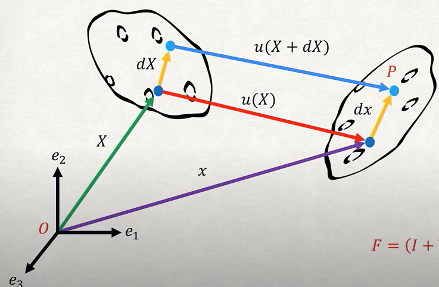

# physics based deep learning note
2022

分类
- Supervised：使用physics模拟生成数据，随后模型训练中不使用模拟器生成额外数据
- Loss-terms：使用可微分physics模拟器做loss项
- interleaved：可微分模拟器，模型输出和可微分模拟器输出共同决定loss值

分类
- forward simulation：预测state改变
- inverse simulation：得到物理公式中的参数

loss term中使用物理信息
- 定义：需要模拟的函数为u(x, t)，$u_x$即函数u对x求一阶导，$u_{xx}$为二阶导
  - u即一关于坐标x和时间t的state
  - 根据一关于$u(x, t)$的pde，可将u写为$u = F(u_x, u_{xx}, ..., u_{xx...x})$

[physical loss term 两varient]

differentiable physics reconstruction：使用simulator。simulate至一特定时刻，使用样本计算loss，back prop得到simulator的参数。例：优化simulator参数为initial state，使得simulator经过一定时间步后生成指定数据

# pytorch based physics informed machine learning youtube video
https://github.com/jdtoscano94/Learning-Python-Physics-Informed-Machine-Learning-PINNs-DeepONets/tree/main

inverse problem
- 在burgurs equation例中，两pde参数参与模型grad descent和模型同时训练

# deepONet实现
- branch模型输入为多个function，每一function u在$[x_1, ..., x_m]$位置取值 用于代表u函数特征
- trunk模型输入为多个(x, t)坐标，称y collocation point
- loss中pde的loss称residual loss
- ？对x求导时是针对(x, t)求导还是包含branch net的x
  - 针对trunk net的x求导，x可以不相同 如pendulum例
- **？branch和trunk 模型的x是否相同**，trunk 模型的(x, t)对应branch 函数的一个u还是多个u
  - pde loss中branch trunk x可不相同，同上一问
  - boundary 和initial condition loss中两模型x不相关。即设计boundary 和initial condition的数据时只需保证x t s覆盖足够样本范围即可
  - 可以有多个u，每一u有collocation point number个(x, t)
- **？branch模型的输入u是多个不同函数**
  - long term integration of Pi deeponet 使用输出s作为下一时刻的u，所以1.每一u为一时刻不同x位置的状态 2.可将initial condition的取值做u的取值 3.initial condition 的loss可为训练模型输出s = u
  - **u仅为一basis func，可使用radial basis function。测试时可替换为测试数据使用的initial func**
    - 如：使用RBF做u训练模型，用sin做u得到测试时模型的输入
- ？为什么branch的输入为2维，而trunk输入为1维，理应trunk得到x t而branch得到u
  - pendulum例子假设y仅为t，u为2维由于有两个state需要学习
- ？u代表函数，但loss定义只需pde和boundary condition，如何使用u
  - u仅作为定义函数的点，类似few shot样本
- **取u的位置为linear？，否则模型如何知道u的变化快慢**
  - 在diffusion reaction例子中取u的x为linear分布，布满整个u domain 即布满整个x可取值的范围
  - **要求每次采样u使用同一集合x位置**
- 看https://github.com/PredictiveIntelligenceLab/Long-time-Integration-PI-DeepONets/blob/main/pendulum/PI_DeepONet_pendulum.ipynb
  - ？operator net为什么输出两个向量分别点乘：由于物理公式针对两值进行pde定义

看Differential Equations as a Pytorch Neural Network Layer 是做什么，如何实现，是否能够令模型得到pde输入
- 对应代码https://gist.github.com/khannay/4cd75e2ff9aecd335f0e770e9d04415c

看deeponet写好的module https://deepxde.readthedocs.io/en/latest/modules/deepxde.nn.pytorch.html
- 使用for loop + torch.autograd.grad

尝试vmap和for loop的时间差
- torch版本只能使用两层for loop，看写好的module怎么加快时间

看jax版本怎么使用gpu
- colab上没成功

尝试将1 batchsize的代码跑通
- 跑通，使用batch的方式进行训练，不然训练时间过长

尝试将tensor分为list，通过grad计算
- grad不支持

尝试使用jacobian方式计算grad，观察是否和grad相同
- grad为jacobian沿一dim求和，jacobian求两向量间所有元素间的斜率，不适用batch情况

physics informed deeponet
- loss中添加物理pde loss项

modified pi deeponet
- 输出的s即u，进行autoregressive预测

有二阶导loss torch怎么办
- 对每一输入分别再次使用torch autograd grad

# fem lecture
https://www.youtube.com/watch?v=tv1TlAebvm0&list=PLnT2pATp7adWUaMh0A8jfoN_OHGAmt_m4&index=2

定义
- node per element NPE：每一element都有固定数量的node
- problem dimension PD：即一node的特征数

- node list：形状(node个数, PD)
  - 即记录每一node 特征，特征例如：xy坐标
- element list：形状(element个数, NPE)
  - 即记录每一element拥有的node的id
- extended node list：形状(node个数, 6 * PD)

- boundary condition matrix：形状(node个数, PD)
  - 所有元素$\in \{1, -1\}$，1代表node在一坐标轴方向是否固定

# fem lecture
https://www.youtube.com/watch?v=IzUfWuh8B8Q

deformation function
- 将$\Omega_0$物体的坐标对应到$\Omega$上
  - 1.position function：$x: \Omega_0 \to \Omega$
    - 物体$\Omega_0$上一点$X$经过deform后的坐标为$x(X) \in \Omega$
  - 2.deformation function：u
    - $u(X) = x(X) - X$

strain公式
- 
- 对点$X + dX$，deform后的坐标可表示为$x(X) + dx$或$X + dX + u(X + dX)$
- $x(X) + dx = X + dX + u(X + dX)$
  - $dx = dX + u(X + dX) + (X - x(X))$
  - $dx = dX + u(X + dX) - u(X)$
  - $dx = dX + \Delta u dX$
  - $dx = (I + \Delta u) dX$
  - 常将$(I + \Delta u)$定义为F，$\Delta u$为u关于X的jacobian matrix
- lagrangian/green strain tensor $C$
  - 定义1：对$dx = FdX$两端取norm，得到$dx^T dx = dX^T F^TF dX$
    - $C = F^TF$即right cauchy green deformation matrix/green strain tensor，计算经过一deform后一物体在$dX$方向的长度变化
    - 当$C = I$时，物体长度不变，为rigid body motion
  - 定义2：$C = I + 2\epsilon_{green}$
    - $\epsilon_{green} = \frac{1}{2}(\Delta u + \Delta u^T + \Delta u^T\Delta u )$
      - 即 将$F = (I + \Delta u)$带入$C = F^TF$并展开
      - 性质：1.$\epsilon_{green}$为symmetric，2.对"finite deformation" valid
    - $\epsilon_{green} = \frac{1}{2}(\Delta u + \Delta u^T)$
      - 假设$\Delta u^T \Delta u << \Delta u$
      - 性质：1.symmetric 2.对small deformation valid
- traction/stress vector
  - 定义：对物体内一平面，令平面norm为n，面积为scalar $\Delta A$，应力stress 向量为$\Delta F$
    - stress vector $t_n = lim_{\Delta A \to 0} \frac{\Delta F}{\Delta A}$
    - 使用3维向量表达：$t_n = \sigma_{n1}e_1 + \sigma_{n2}e_2 + \sigma_{n3}e_3$
      - $e_1, e_2, e_3$为场景basis

finite element
- degree of freedom：控制一element的变量个数，例 一维rod被拉伸时有2 dof，由于每一段rod的首尾node各有一displacement
- shape function：$N_i$使得u可被写为$u_1N_1 + u_2N_2 + ...$的形式
  - $u$即deformation function，$u_i$为一nodal point $X$通过u的输出
    - nodal point可取node。当deformation function为二次函数时，需取额外X用于定义一唯一deformation function，此时选择的额外nodal point不为node，可取两node中点
  - $N_i$为关于X的函数，即一basis func将X转为 以$u_i$做参数的函数 的输入
- nodal force：每一node的受力
  - 1d rod例：$-\int_0^L pN_i dX$
    - "p为force"
- local stiffness matrix
  - square matrix，边长为针对一element的DoF数
  - 1d rod例：$\int_0^L EA (\Delta_X N) (\Delta_X N)^T dX$
    - 积分为按元素求积分
- global stiffness matrix
  - 合并local stiffness matrix，为square matrix，边长为整个模型DoF数
  - 将local stiffness matrix填入global stiffness matrix对应dof位置。当一位置有来自多个stiffness matrix的值时，多个stiffness值相加

L2：求微分方程
L3：virtual world等近似解
L4：finite element将物体分为部分单独求解，能够将virtual world公式用于微分方程无法对整个物体定义的场景

