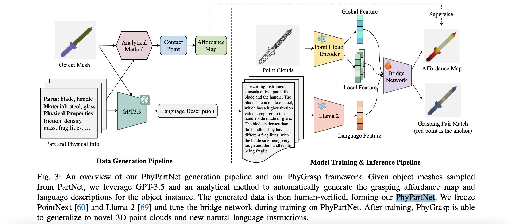
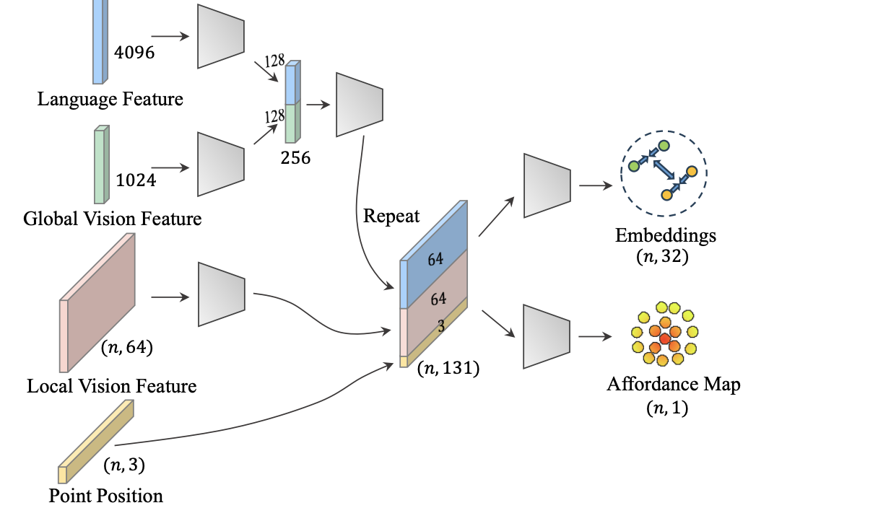

# PhyGrasp: Generalizing Robotic Grasping with Physics-informed Large Multimodal Models
2024

LLM + 3d 点云做输入，使得模型能够理解一物体易碎部分，避免机器人损坏易碎物品

相关工作
- **physical reasoning**
  - 使用interaction data做输入，预测physical property
    - [2015 NIPS] Galileo: Perceiving physical object properties by integrating a physics engine with deep learning
    - [2016] Physics 101: Learning physical object properties from unlabeled videos
    - [2020] Visual grounding of learned physical models
  - 学习包含物理信息的特征，不直接预测物理信息
    - [2019 ICLR] Reasoning about physical interactions with objectoriented prediction and planning
    - [2019 RSS] Densephysnet: Learning dense physical object representations via multi-step dynamic interactions
    - [2021 NIPS] Dynamic visual reasoning by learning differentiable physics models from video and language
    - [2020] Learning long-term visual dynamics with region proposal interaction networks
    - [2022] Comphy: Compositional physical reasoning of objects and events from videos
    - [2021] Physion: Evaluating physical prediction from vision in humans and machines
    - [2024] Physion++: Evaluating physical scene understanding that requires online inference of different physical properties
  - 使用llm或vlm进行physical reasoning
    - [2023 ICLR] Mind’s eye: Grounded language model reasoning through simulation
    - [2023] Can language models understand physical concepts?
    - [2023] Physically grounded vision-language models for robotic manipulation

模型
- PhyPartNet
  - 
  - 得到一物体点云，对每一位置预测材料 易碎性 质量 密度 摩擦力信息
  - 使用以上信息对一物体生成Affordance Map，代表每一物体部分可以用于抓取的几率
    - 使用analytical方法，得到物体物理属性的gt，条件为限制一point上的压强等，生成Affordance Map
      - 图中analytical输入的文本 即给定的物理属性gt，为
  - vision encoder：
    - 
    - 使用预训练PointNeXt抽点云全局特征(1024维度) 并对每一point抽局部特征(64维度)
    - mlp得到每一point特征为[nlp文本全局特征, 点云全局特征, point 64维特征, point坐标]，对每一point预测 [特征, affordance值]
      - 对应的affordance pair特征应该相近
      - affordance值和analytical 得到的affordance map应相近
- 使用llm理解指令，生成期望的robot pose，通过analytical方法得到robot每一joint应旋转的角度

# Visual Grounding of Learned Physical Models
2020

模型
- 输入为多帧连续图像$O_t$，模型预测几何结构，预测后续帧的场景变化
- cnn + linear layer模型，$f_V(O) = (X, G)$
  - $X = \{(x, y, z)\}^{N}$ 为一帧图像中point的三维坐标
  - $G = \{m\}^{N}$ 为每一point的类别标签，标明point属于哪一物体
  - 模型对每一帧输入图像分别预测(X, G)
- dynamic guided inference：$f_I(X, G) = (P, Q, \Delta X)$
  - P为物理参数
  - Q为binary mask，代表每一point是否属于rigid物体
  - $\Delta X$为对坐标位置X的refinement
  - 三变量分别使用gnn + 序列处理模型进行预测
- dynamic prior：$f_D(X^T, G, P, Q) = X^{T+1}$
  - 预测后续point坐标
  - 使用gnn处理每一point
    - $h_i^t = \phi_{gnn}(v_i^t, \sum_j g_{ij}^t)$
      - 从一point i特征$v_i^t$ 和 临近point的特征和$\sum_j g_{ij}^t$预测point i新特征$h_i^t$
    - 每一point输入特征为坐标X和物理参数P，物理参数P为给定参数
  - 使用DPInet，得到每一node i以往T时刻的gnn特征，预测下一时刻坐标
    - $X_i^{T+1} = \phi(\{h_i^t\}^{1..T} | G_i, Q_i)$
    - 根据Q，属于同一rigid物体的point共用一transformation，保证一rigid物体不同时刻形状不变

# Physically grounded vision-language models for robotic manipulation
2024

vlm + physics进行robot planning，"通过视觉实现reasoning"
- 提出PhysObjects数据集

相关工作
- physical reasoning
  - 从interaction data学物体物理属性
    - 15–17
  - 学物理特征representation
    - VEC 21：用vlm/llm进行physical reasoning，reasoning部分通过文本
  - openscene 14：使用clip检测物体物理属性

模型训练
- 模型输入一图片和一文本，文本提问图片物体的物理属性，模型输出属性
- 人工label对一文本和一对图片，标注哪一图片被提问的物理属性更高。训练模型输出的物理属性排序符合人工标注
- 自动标注：
  - 对categorical物理属性，固定将一类别物体对应一物理属性category
  - 对continuous物理属性，看做此物理属性仅有high/low两类，固定将一类别物体对应high/low中一类

# Mind’s eye: Grounded language model reasoning through simulation
2023

将提问转为simulation code，传入physics engine，得到的输出做prompt进行inference

# VEC：Can language models understand physical concepts?
2023

提出分析vlm理解物理性质的task
- 文本提问图片中物体的颜色 材质等信息，取gt词的prob做模型预测
- 文本提问图中两物体的比较，如质量 温度 硬度等。分别对3物理属性提出有标号数据集

# Dynamic visual reasoning by learning differentiable physics models from video and language
2021

提出Visual Reasoning with Differentiable Physics VRDP：同时学一物体physics model和物体间交互

相关工作
- physical model：
  - video prediction
    - PhyNet及后续工作
      - [2016 NIPS] Unsupervised learning for physical interaction through video prediction
      - [2016 ICML] Learning physical intuition of block towers by example
      - [2018 ECCV] Interpretable intuitive physics model
      - [2019 ICCV] Compositional video prediction
  - simulation rendering
    - [2019 ICLR] Propagation networks for modelbased control under partial observation
  - dynamic reasoning
    - [2016] Interaction networks for learning about objects, relations and physics
    - [2017 NIPS] Visual interaction networks: Learning a physics simulator from video
  - 预测力对物体的影响
    - [2016 NIPS] Learning to poke by poking: Experiential learning of intuitive physics
    - [2020 ICLR] Contrastive learning of structured world models
    - [2016 ECCV] “what happens if...” learning to predict the effect of forces in images
- physical scene understanding
  - [2019 NIPS] Phyre: A new benchmark for physical reasoning：仅从图像学习physical understanding reasoning
    - 人工定义每一张图的reward，训reinforce模型 使用物理知识 输出action影响场景达到目标状态
  - 将场景deconstruct，从motion预测物理性质
    - [2017 NIPS] Learning to see physics via visual de-animation
    - [2020 NIPS] Learning physical graph representations from visual scene

模型
- visual perception module：对视频每一帧图像 抽物体移动轨迹特征
  - 使用fast RCNN，对T帧的视频抽$N \times (D + 4T)$维度的特征
    - N为物体个数
    - 每一物体有D维RoI pooling特征，有4T维度特征代表每一帧物体在图像中位置，即每一帧中物体所在位置用4维向量表示 称trajectory特征
      - **4维特征包含 [物体锚框坐标, 物体在BEV下的xy坐标]，使得模型无需限定输入视频为BEV视角视频**
  - 对两两物体 抽$T \times N \times N \times 12S$特征$f_{pair}$
    - $f_{pair}(t, i, j)$代表t帧ij物体间关系 为12S维度向量。12S维度包含[前后S/2帧中ij分别的trajectory特征, 前后S帧中ij trajectory特征的差值]
    - 差值用于记录ij物体间距
- concept learner：
  - 得到nlp指令，输出program对物理模拟结果提问
- physics engine：可微分，预测physics特征值，如mass值
  - 每一步预测下一时间步场景状态，得到concept learner输出的program指定的物理变量，做整个模型最终输出
- 三部分都可微分，concept learner输出program执行过程也可微分
  - **使得执行program 物理engine 可微分，进行end-to-end训练**

？todo：concept learner physics engine如何使用视觉信息，如何将普通视角转为bev，如何end to end训练

# Phyre: A new benchmark for physical reasoning
2019

提出phyre数据集
- 场景考虑的物理信息仅包含 重力 撞击 摩擦
- 训练模型使得对不同task generalize + 使得模型使用物理信息解决问题
- 不需要nlp理解任务

相关工作
- 39 41：判断一复杂场景是否物理playsable
- 使用feedforward模型进行pixelwise预测后续状态
  - 11 24 34 60
- 使用feedforward模型qualitative预测后续状态
  - 12 26 27 34 61

模型
- 模型得到一图像，输出为action 为在场景中放置一个或多个可移动物体，使得场景中指定两物体被放置的物体撞击后接触
- 输入为图像，每一物体颜色分别代表物体 是否能够被移动/是否为指定应接触的物体 等类别
- 模型输出action，为放置的物体的位置

训练
- train：模型得到 训练图像，使用物理simulator得到action后的结果
- test：模型重复：选择action，得到 binary结果代表是否成功 + simulator中间时间步图像，优化后重新选择action
  - eval时根据attempt次数比较模型

# Learning to See Physics via Visual De-animation
2017

得到图像，使用目标检测模型对每一物体预测物理属性(质量 形状 摩擦力 坐标 pose)，输入物理engine + renderer预测后续帧图像
- physics engine和renderer 可微分，直接对预测的后续图像计算loss end-to-end 训练

