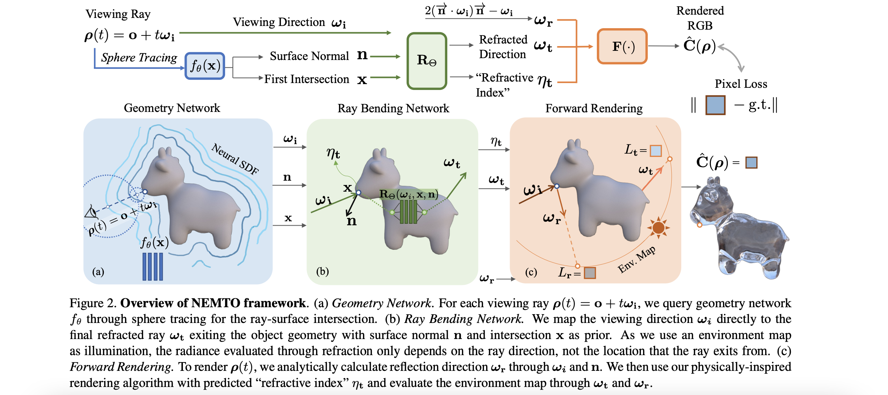

# UniSDF: Unifying Neural Representations for High-Fidelity 3D Reconstruction of Complex Scenes with Reflections
2023

3d重建，考虑reflection

相关工作
- nerf + reflectance
  - [2022 CVPR]Ref-NeRF: Structured view-dependent appearance for neural radiance fields：使用物体表面norm
  - [2023] ENVIDR: Implicit differentiable renderer with neural environment lighting：使用物体材质信息重建有光滑表面的物体，但导致物体表面细节缺失
  - [2023] BakedSDF: Meshing neural sdfs for real-time view synthesis：使用模型类似Ref-Nerf模型 + VolSDF模型，重建光滑物体表面，但导致物体表面细节缺失
    - 43：VolSDF

模型
- 
- 坐标x通过iNGP得到position embedding $\gamma(x)$
  - iNGP在不同pyramid level的特征$\gamma_l(x)$ concat得到特征$\gamma(x)$
- SDF mlp预测位置x的sdf $d(x)$
  - 使用contracted space：当$\|x\| \leq 1$时 $contract(x) = x$，当$\|x\| > 1$时 $contract(x) = (2 - \frac{1}{\x|\|})(\frac{x}{\|x\|})$
  - 得到$\gamma(x)$，预测(函数输出$d(x)$, 法线方向n', 颜色context b)
  - 计算一位置的法线方向为$n = \nabla d(x) / \| \nabla d(x) \|$
    - 即对$d(x)$关于x求导，得到一sdf值关于临近位置的导数
    - 此法线方向用于后续计算，模型预测的n'仅用于近似$n$，（？使得模型学习法线信息
  - 一位置的density为$\sigma(x) = \alpha\delta(d(x))$
    - $\alpha$为参数，$\delta$为0 mean的spike distribution，即当$d(x) = 0$时density最大
- $f_{ref}$得到(x位置, 反射光线方向$w_r$, 颜色context b, 法线 n)，预测反射光线路径上的颜色
- $f_{cam}$得到(x位置, 视线方向$\bf d$ 颜色context b, 法线 n)，预测直射的颜色
- weight mlp预测反射和直射颜色的相对权重

代价函数
- 颜色loss
- eikonal loss：
  - $L = E_{x}[(\|\nabla d(x)\| - 1)^2]$
- norm n n'间差别loss
  - $L = \sum \|n - n'\|^2$
- norm n和d方向差别loss：
  - $L = \sum max(n \dot \bf d)^2$
  - 即 一点如果为可见点，则此点的norm n不应和和视线方向$\bf d$相反

# NeRRF: 3D Reconstruction and View Synthesis for Transparent and Specular Objects with Neural Refractive-Reflective Fields
2023

考虑重建场景中的折射和反射，并且通过物体反射折射重建背景environment radiance

相关工作
- reflective 场景重建
  - 88：使用物体轮廓重建反光/透明物体
  - 44 45 46 79：重建表面非漫反射的物体
  - 52：将一反光物体表面图像分为view dependent和view independent部分
  - 33：使用parametric BRDF模拟反射
  - 59 23：将一图像分为直射颜色和反射颜色两部分
  - [2023 CVPR] **Nerf-ds**: Neural radiance fields for dynamic specular objects：重建动态的反光物体
  - 64 24：使用物理公式模拟物体表面view direction改变
- refraction 场景重建
  - 针对一特定背景环境，如假设背景为全灰
    - [2020 ACM TOG] Differentiable refraction-tracing for mesh reconstruction of transparent objects
    - [2023] **Neto**: Neural reconstruction of transparent objects with self-occlusion aware refraction-tracing
    - [2018] Full 3d reconstruction of transparent objects
    - [2022] **Hybrid mesh-neural representation for 3d transparent object reconstruction**
  - 使用Eikonal rendering中的ray equation模拟光路
    - [2023 SIGGRAPH] Sampling neural radiance fields for refractive objects
    - [2022 SIGGRAPH] Eikonal fields for refractive novel-view synthesis
  - [2023] **Nemto**: Neural environment matting for novel view and relighting synthesis of transparent objects：使用ray bending net预测光路

模型
- 1.得到物体轮廓mask，直接从mask预测物体几何结构
  - 避免由于物体表面的反光导致对物体表面norm/depth预测出错
  - 使用预训练segmentation模型预测mask
  - 使用可微分的场景重建模型 Deep Marching Tetrahedra DMTet 得到物体模型
    - 每一vertice位置$v_i$包含一sdf值$s_i$和一deformation向量$\Delta v_i$
  - 使用progressive encoding：随训练步数增加 增加position embedding的维度。避免从一开始使用高维度position embedding导致mesh表面noise
- 2.使用物理公式计算折射-反射光线方向 和 折射-反射相对权重，得到一视线的颜色。学nerf mlp预测每一段光线的颜色

# Neto: Neural reconstruction of transparent objects with self-occlusion aware refraction-tracing
2023

使用grid背景，可得到一视线通过折射后在背景上的坐标o。优化sdf 使得通过物体折射后 视线在背景的落点o'和o相同

# NeRF-DS: Neural Radiance Fields for Dynamic Specular Objects
2023

重建反光的移动物体

相关工作
- [2021] **HyperNeRF**: A higherdimensional representation for topologically varying neural radiance fields：使用hyper coordinate input模拟移动场景，而非使用物体template + 在随后帧的deform预测物体移动 
- 使用translation field 模拟位移/deform
  - 23 36 50
- 使用special euclidean SE(3) field
  - 33 34

预测物体mask，用于重建物体结构。

使用SE(3)，即对每一时刻预测一[R | t]矩阵，将world coordinate的坐标x/norm转为相机coordinate中的坐标x/norm。预测deform

使用物体表面norm作模型输入，便于预测反射颜色

# PhysGaussian: Physics-Integrated 3D Gaussians for Generative Dynamics
2024 CVPR

gaussian splatting + 物理公式模拟deform/移动

相关工作
- 将物理deformation公式加入nerf，将nerf学得的结构export为mesh进行后续模拟
  - [2023] Neural impostor: Editing neural radiance fields with explicit shape manipulation
  - [2022 NIPS] **Neuphysics**: Editable neural geometry and physics from monocular videos
  - [2022 CVPR] Nerf-editing: geometry editing of neural radiance fields
- 使用explicite geometric representation进行forward modeling
  - **5 20 43 46 47**
  - PAC-neRF：使用物理simulator得到更"dynamic behaviour"
- **material point method**：9：用于模拟多种物理现象的framework

模型
- gaussian splatting
  - 每一gaussian p有[center位置$x_p$, opacity $\sigma_p$, covariance matrix $A_p$, spherical harmonic coefficient $C_p$]
  - 一gaussian贡献的颜色为$C = \sum_k \alpha_p SH(d_k, C_k) \prod_{j=1}^{k-1}(1 - \alpha_j)$
    - $\alpha_k$为k gaussian在视线交点位置的density和$\sigma_k$的乘积
    - $d_k$为视线方向
  - 优化：
    - internal filling
    - 由于当一物体deform为两个物体时，内部gaussian 将变为可见，创建gaussian splatting时应对物体内部同样创建gaussian避免出现物体内部空腔
      - 判断一点p是否处在物体内部的条件
        - 1.从一点向周围6方向(xyz轴正负方向)发射射线都和物体相交
        - 2.从一点发射的任意射线都和物体仅相交奇数次
        - 判断射线相交：观察射线路径上的density改变有没有高于阈值
    - anisotropy regularizer
      - 在较大deform时，较细的gaussian导致物体表面出现毛刺
      - 解决：限制所有gaussian的长边和宽边比例不高于一阈值，否则loss升高
- 动态gaussian splatting
  - 模拟gaussian dynamics
    - 假设每一gaussian p的deform后结果为 $x_p^t = \phi_p(x_p^0, t)$ $A_p^t = F_p^t A_p F_p^t$
  - 由于SH为hard coded，通过旋转视线方向得到不同角度的SH，从而得到旋转后的SH取值
  - incremental evolution of gaussian
    - ？替代MPM和continuum mechanics 公式的方法
  - continuum mechanics
    - conservation of mass：$\int_{B_t} \rho(x, t) = \int_{B_0} \rho(\phi^{-1}(x, t), 0)$
      - $\phi^{-1}(x, t)$得到 将t时刻x的位置warp回t=0时刻时x的位置
      - $B_t, B_0$分别为t时刻和t=0时刻空间中一小块区域，有$\phi(B_0, t) = B_t$
      - $\rho(x, t)$为t时刻在x位置的density
      - 即 空间中一小块区域内 物体density在移动前后保持一致
    - conservation of momentum
      - $\rho(x, t)\dot{v}(x, t) = \nabla \dot \sigma(x, t) + f$
      - f为外界施加的力，$\rho(x, t)$为density，$\dot{v}(x, t)$为加速度
      - $\sigma = \frac{1}{det(F)} \frac{\partial \psi}{\partial F}(F^E){F^E}^T$
        - 为关于hyperelastic energy density $\psi(F)$的cauchy stress ternsor
      - 即 物体一位置的加速度 = -内部弹性势能增加的微分 + 外力
  - material point method MPM
    - ？如何和gaussian scene representation合并

# VR-GS: A Physical Dynamics-Aware Interactive Gaussian Splatting System in Virtual Reality
2024

提出physics aware, vr gaussian splatting修改系统

相关工作
- 使用gaussian splatting + 物理公式 模拟deform
  - PIE-NERF，Physgaussian

模型
- 1.生成gaussian splatting
- 2.使用2d图像segmentation模型，对图像segment，每一gaussian kernel学自身对应的物体类别
- 3.inpainting：由于和其他物体有接触，一物体gaussian splatting在接触面将产生洞
  - 取一物体的gaussian splatting，使用2d inpainting生成接触面的图像
  - 优化gaussian splatting使得接触面投影满足inpainting结果
- 4.gaussian splatting生成mesh
  - 每一gaussian中心做点云中的点，使用marching cube生成mesh
- 使用mesh做模拟器输入，物理信息deform mesh。从mesh顶点坐标得到deform矩阵，对gaussian应用deform
  - two level embedding procedure：保证一mesh内部的gaussian deform后仍被mesh完全包围，避免deform后物体表面出现毛刺

# PIE-NeRF: Physics-based Interactive Elastodynamics with NeRF
2023

使用generalized moving least square模拟implicite model的deformation，使用meshless 方法模拟场景deform

相关工作
- meshless simulation
  - 使用unstructured vertice替代预先定义的mesh
    - 49：处理continuum mechanics
    - 48：shape matching
  - position based method：基于shape matching
    - 45 47 66

模型
- 使用NGP encode坐标x，对场景使用NGP坐标训nerf
- "将particle disperse进场景，得到类似点云的 对物体形状的proxy"
- 使用Voronoi partition进行grouping，grouping中心作为classic lagrange mechanics中的q
- 选择部分point作为integrator point IP，使用物理公式deform IP
  - classic lagrange mechanics
    - ？和phygaussian对应
    - $\frac{d }{dt} (\frac{\partial L}{\partial \dot{q}}) - \frac{\partial L}{\partial q} = f$
      - $L = T - U$ 为lagrangian，即kinetic energy - potential energy
      - $q, \dot{q}$为位置坐标和速度向量，f为外界力
- 使用IP位置的deform推测其余point的deform

# PAC-Nerf: Physics Augmented Continuum Neural Radiance Field for GeometryAgnostic System Identification
2023

使用Eulerian grid表示nerf的density和颜色信息，使用Lagrangian particles模拟nerf中物体的的移动

相关工作
- 动态场景
  - [2022 ACM MM] **Physics informed neural fields for smoke reconstruction with sparse data**：模拟烟尘，没有物体boundary 导致无法进行碰撞检测
  - [2022 ICML] **Neurofluid**: Fluid dynamics grounding with particle-driven neural radiance fields：nerf + fluid dynamics
- deformable 场景
  - neural方法：
    - [2019 ICLR]Learning particle dynamics for manipulating rigid bodies, deformable objects, and fluids
    - [2019] Densephysnet: Learning dense physical object representations via multi-step dynamic interactions
    - [PMLR 2020] Learning to simulate complex physics with graph networks
  - gradient free method
    - [ACM TOG 2019] Video-guided real-to-virtual parameter transfer for viscous fluids
  - [differentiable physics simulation]
  - [CVPR 2022] Virtual elastic objects：不同于differentiable physics simulation方法，不使用已知场景mesh进行预测

模型
- 将nerf的Eulerian view (grid view) G转为Lagrangian view (point view)P
  - 令i代表grid node位置 p代表point位置
  - $F^P_p$代表point p的density，$F^G_i$代表point i的density
  - $F^P_p = \sum_i w_{ip} F^G_i$ $F^G_i = \frac{\sum_p w_{ip} F^P_p}{\sum_p w_{ip}}$ 
    - $w_{ip}$为node i density对p位置contribution
- 1.使用nerf重建场景，将nerf通过以上方法转为lagrangian view
  - nerf使用一mlp + $160^3$维度voxel
  - [CVPR 2022] Direct voxel grid optimization: Super-fast convergence for radiance fields reconstruction
    - voxel + nerf进行重建，不处理dynamic场景
    - 处理cloud effect：初始化voxel使得全部视角都为透明，随后对不可见的位置使用小learning rate，避免少样本区域出现cloud
    - 提出post activation：先interpolate得到视线上一点的density ，随后计算softplus + alpha值，好于先计算alpha或softplus 后interpolate采样
  - ？使用dynamic nerf重建后 是使用mpm模拟后续变换 还是mpm辅助重建后续变化并学习参数
  - 数据预处理：使用segmentation模型移除背景
- 2.转为lagrangian view
  - 对每一voxel 采样8个点，作为point，计算每一点density $\sigma_p$
  - 每一point计算scalaing factor $\alpha_p = 1 - e^{-softplus(\sigma_p)}$
    - $\alpha_p$低于一阈值的point看做透明，移除
    - 对$\alpha_p$较小的point，将physical density field值$\rho$和physical stress field $T$ scale by$\alpha_p^3$
      - ？nerf预测的density和物理density如何转换
  - 增加loss辅助重建效果：$L = \sum_p clamp(\alpha_p, 10^{-4}, 10^{-1})(\frac{\Delta x}{2})^2$
    - 即减少重建物体的表面积
    - ？对内部point使用此loss计算的是哪一方向的表面积
- 使用material point method模拟后续变化，将变化后的point转回eulerian view用nerf进行渲染

？如何定义物理公式输入信息
？如何recover物理信息

# Learning particle dynamics for manipulating rigid bodies, deformable objects, and fluids
2018

提出可微分的particle based simulator，可用于模拟fluid/rigid 物体
- 使用gnn，每一particle做node进行后续particle状态预测
- hierarchical modeling for long-range dependence：
  - 模拟长sequence的graph state需要每一node特征通过rnn进行下一时间步的状态预测，node数量过多，计算量过大
  - 解决：对每一物体，创建一global node和所有物体内particle node相连，通过rnn计算后一时间步信息时仅使用global node特征进行计算
- ？每一物体内particle都创建node，数量是否过大，如何定义哪些位置创建particle

[相关工作]

# PhysNerf：Neurofluid: Fluid dynamics grounding with particle-driven neural radiance fields：nerf + fluid dynamics
2022

一transition模型预测particle 下一时刻state，另一nerf模型得到particle state生成图像，生成的图像和gt图像计算loss优化两模型
- 无需对particle state transition模型使用gt训练，从图像信息训练transition模型预测后续particle state
- 第一帧particle state已知
- 由于使用两模型同时训练，需避免模型collapse：在第一帧得到不同视角图像，预训练nerf模型。后续帧中nerf模型同样参与训练

# NEMTO: Neural Environment Matting for Novel View and Relighting Synthesis of Transparent Objects
2023

处理透明物体relighting，能够对geometry精确度不高的物体进行relighting

相关工作
- environment matting：？从一透明物体得到光线在场景中的reflection/refraction传播路径
  - [2000] 8 
  - [1999] 44
  - [2018] 7："使用refractive flow field模型表示environment matting"
  - [2002]33：重建物体的背景可为任意场景，但模型需要场景中有structured background light
- 透明物体重建
  - 21：假设物体indices of refraction值和场景光照已知，使用同一模型重建不同物体结构
  - 2：不假设得到物体IOR，但只能重建简单结构的物体，如一球体

模型
- 
- SDF模拟物体geometry
- neural environment matting：mlp得到[视线方向, 视线和物体交点, 交点处法线方向]，直接预测1.通过物体内部refraction后离开物体的视线方向 2.交点处的IOR
  - 训练mlp：使得预测方向 和 物理公式计算的refraction方向 一致

展示的图像效果好于nerf Physg 

（skip，物理模拟部分仅为neural environment matting中的mlp）

# Physics Informed Neural Fields for Smoke Reconstruction with Sparse Data
2022

模型将静止的固体和移动的烟雾分开重建。用layer-by-layer growing strategy依次训练模型每一层

[相关工作]

模型
- 两nerf分别预测density color和point velocity
  - $f_{i}(x, y, z, t) \to (c, \sigma)$, $f_{v}(x, y, z, t) \to u$
  - 假设烟雾粒子为漫反射，$f_i$模型不得到视线方向做输入
  - 使用vgg模型对render后的图像抽特征，使得特征和实际图像特征相同
- 代价函数
  - 1.使用物理公式限制输出
    - transport equation：
    - Navier-Stokes equation：
    - 避免上两公式导致模型仅预测$\frac{d \sigma}{d t} = 0$：使用$f_v$模型预测的v将一时刻density warp回最初时刻，warp得到的模型输称$I'$
    - ？是否不使用f_i预测的density了，如何使用I'
  - 2.训练gan得到一3d density grid，输出3d velocity grid
    - gan作为额外guidance，模型预测的velocity应和gan输出保持一致
  - 3.Tackling Color-Density Ambiguity
    - 模型不优化density，而是将背景对应位置设为一颜色
    - 用layer-by-layer growing strategy解决
      - ？layer-by-layer growing strategy
  - 先对静止固体训练一nerf，输出图像和烟尘输出图像overlay，和gt图像计算loss

# Virtual Elastic Objects
2022

重建一物体 + deformation field，使用可微分particle based simulator预测不同情况下的deformation
- meshless simulation
- 使用透明鱼线/气流吹物体进行deform，测试即使用不同鱼线/气流config

相关工作
- 44：直接从数据学physics law，不使用任何prior
- [2019] Latent-space dynamics for reduced deformable simulation：使用autoencoder学elastic deform的subspace特征
- 16：预测衣物的deform
- "fit parameterized material model to observed deformation"
  - 20，47：已经在biomedical system中应用
  - 6：预测一物体在无重力情况下的后续pose
  - 17，18：设计soft robot
  - 7，12：在有摩擦的表面进行motion planning
- meshless simulation
  - [2004] 34，[2005] 41：针对melting/碎裂场景
  - 14 30 33：支持oriented particle的meshless simulation

模型
- 使用NR-Nerf学场景 + deform
  - 学一mlp，得到(坐标x, t时刻图像特征$I_t$)，输出$b(x, I_t)$ 将x warp至t=0时刻的坐标$x_0$，从nerf得到$x_0$颜色
- 从nerf抽点云
  - opacity高于一阈值的点做物体point
- 使用可微分physics engine学两物理参数
  - 对物体的作用力 为已知值输入模型
- 使用学习得到的物理参数 对新的作用力config预测deform

# Video-guided real-to-virtual parameter transfer for viscous fluids
2019

从视频得到流体的物理参数，即进行inverse problem

# Latent-space dynamics for reduced deformable simulation
2019

# Augmented Incremental Potential Contact for Sticky Interactions
2023

模拟弹性物体间的粘粘

相关工作
- [模拟物体粘连]
- [barier based contact]

Incremental Potential Contact (IPC)
- （todo）

# 3D Reconstruction of Transparent Objects with Position-Normal Consistency
2016

假设refraction 光路仅两条

得到一人跑动视频，更改土地为沙地，生成视频符合修改